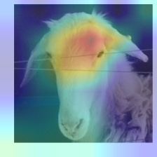

# tickling-Vision-Models


[](assets/image.png)
<p align="center">
  <br>
  <em>activation maximized feature visualizations for top feature directions</em>
</p>


# core functionalities
collect activations from a selected set of layers passing images from a subset of classes
```bash
python -m scrips.collect_activaions
```

train decomposers on pixel / patch actviations and checkpoint weights
```bash
python -m scripts.train_decomposers
```

top direction feature visualization using sparse representation activation maximization
```bash
python -m scripts.pain_atlas
```

test causal impact feature patching with donor acctivations on model predictions
```bash
python -m patch_features
```


[](assets/image.png)
<p align="center">
  <br>
  <em>summer fever headache (some may call it "Grad-CAM")</em>
</p>
