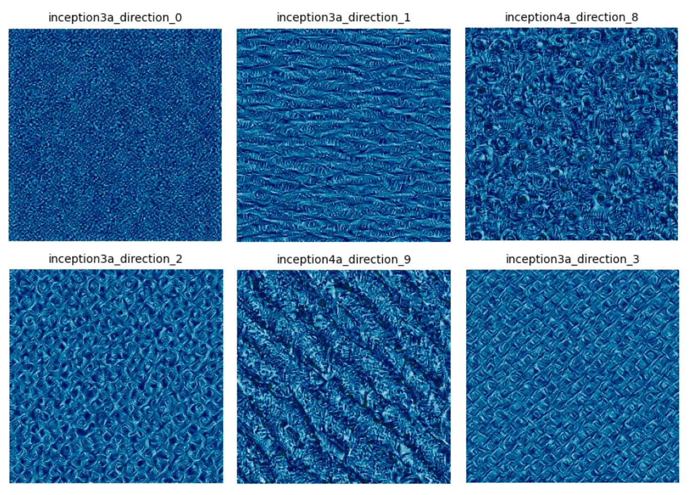

# Tickling-Vision-Models

<table>
  <tr>
    <td colspan="2" style="text-align:center;">
    <p align="center">
      <br>
      <em>activation maximized feature visualizations for top feature directions</em>
    </p>
    </td>
  </tr>
  <tr>
    <td style="text-align:center;">
    <p align="center">
      <br>
      <em>Donor-Target influence (top5 logits)</em>
    </p>      
    </td>
    <td style="text-align:center;">
    <p align="center">
      <br>
      <em>ablation effectiveness per sample</em>
    </p>
    </td>
  </tr>
</table>


# core functionalities
collect activations from a selected set of layers passing images from a subset of classes
```bash
python -m scrips.collect_activaions
```

train decomposers on pixel / patch actviations and checkpoint weights
```bash
python -m scripts.train_decomposers
```

top direction feature visualization using sparse representation activation maximization
```bash
python -m scripts.pain_atlas
```

test causal impact feature patching with donor acctivations on model predictions
```bash
python -m scripts.patch_features
```

test logits shift on adversarial examples and directional adversarial residual ablation for recovery
```bash
python -m scripts.adversarial_attack_ablation
```


<p align="center">
  <br>
  <em>summer fever headache (some may call it "Grad-CAM")</em>
</p>
